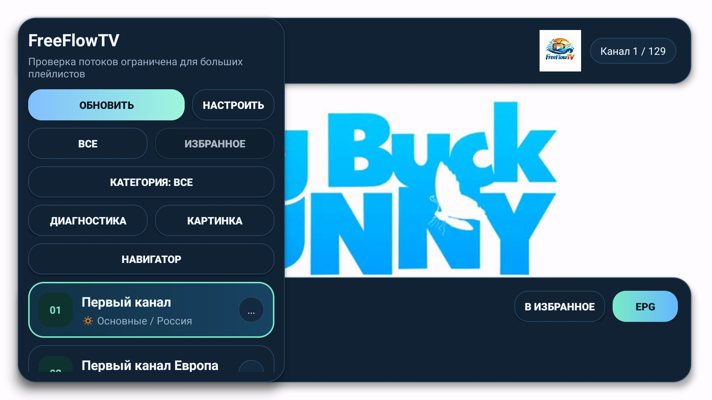
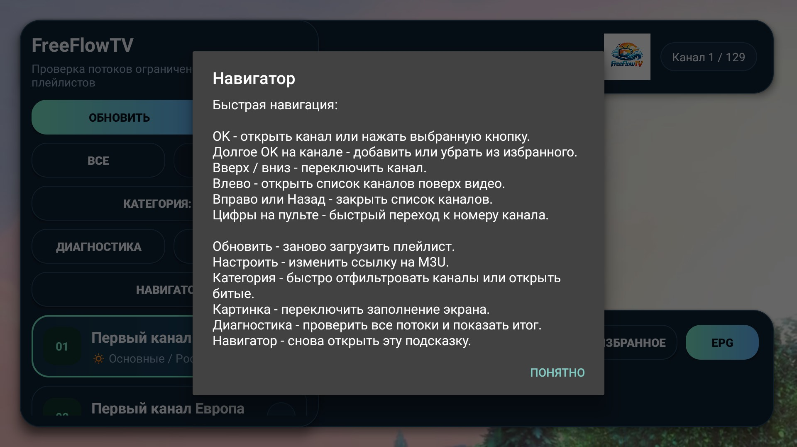
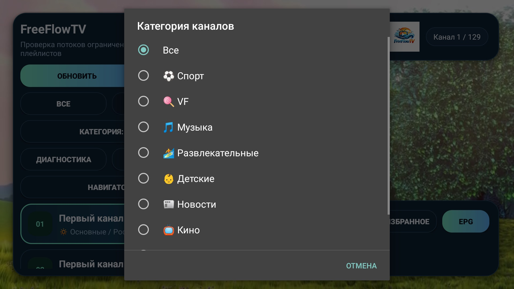
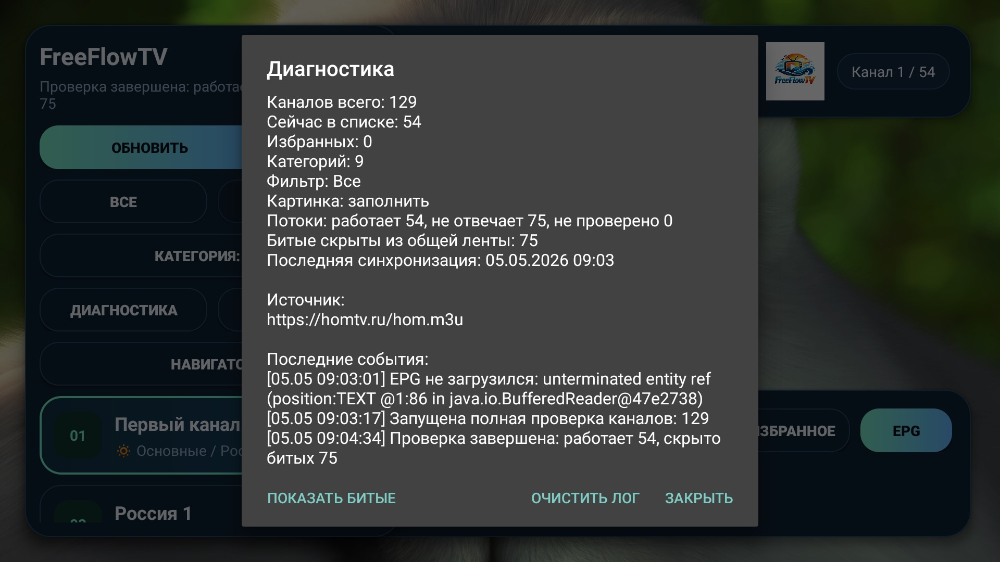

# FreeFlowTV

Легкий IPTV-плеер для Android TV и Smart TV с управлением через обычный пульт.

[](#)
[](#)
[](#)
[](#)

<p>
  
  
</p>
<p>
  
  
</p>

## Что это

FreeFlowTV создан для удобного просмотра IPTV-каналов из пользовательских M3U/M3U8-плейлистов на телевизоре. Интерфейс рассчитан на слабые Android TV-приставки: крупные элементы, быстрый список каналов поверх видео, минимум лишней анимации и управление с пульта.

После установки приложение можно открыть сразу: внутри есть встроенные демо-каналы для проверки запуска, интерфейса и работы плеера без регистрации и без обязательного ввода своего плейлиста.

FreeFlowTV не предоставляет платный ТВ-контент. Пользователь подключает собственные легальные M3U-источники.

## Возможности

- Импорт пользовательских M3U/M3U8-плейлистов.
- Встроенные демо-каналы для быстрой проверки приложения.
- Быстрый список каналов поверх видео.
- Переключение каналов кнопками `CH+` и `CH-`.
- Категории каналов.
- Избранные каналы.
- EPG/телепрограмма, если она есть в источнике.
- Диагностика потоков.
- Скрытие нерабочих каналов из общей ленты.
- Отдельный список битых каналов.
- Сохранение последнего канала.
- Загрузка в стиле YouTube TV при запуске приложения и открытии канала.
- Навигатор с подсказками по управлению с пульта.

## Скачать APK

Готовый APK лежит в репозитории:

```text
release/FreeFlowTV-1.0.8.apk
```

Для GitHub лучше дополнительно прикрепить APK к релизу `v1.0.8`, чтобы пользователю было проще скачать файл с вкладки Releases.

## Сборка проекта

Требования:

- Android Studio или Android SDK.
- JDK 17.
- Gradle 8.7 или совместимый установленный Gradle.

Команда для проверки и сборки:

```powershell
./gradlew :app:testDebugUnitTest :app:assembleRelease
```

Если нужен подписанный релиз, передайте параметры подписи через переменные окружения или свойства Gradle:

```text
FREEFLOWTV_UPLOAD_STORE_FILE
FREEFLOWTV_UPLOAD_STORE_PASSWORD
FREEFLOWTV_UPLOAD_KEY_ALIAS
FREEFLOWTV_UPLOAD_KEY_PASSWORD
```

Файлы ключей и пароли не должны попадать в репозиторий.

## Версия 1.0.8

Главное обновление по сравнению с опубликованной 1.0.4:

- Добавлена загрузка в стиле YouTube TV.
- Диагностика проверяет все каналы и показывает итог после завершения.
- Битые каналы скрываются из общей ленты, но доступны отдельно.
- Добавлены категории каналов.
- Улучшен навигатор управления с пульта.
- Повышена стабильность при битых M3U, JSON, EPG и поврежденном кеше.
- Добавлены демо-каналы для проверки без входа и ручной настройки.

Подробности: [CHANGELOG.md](CHANGELOG.md).
